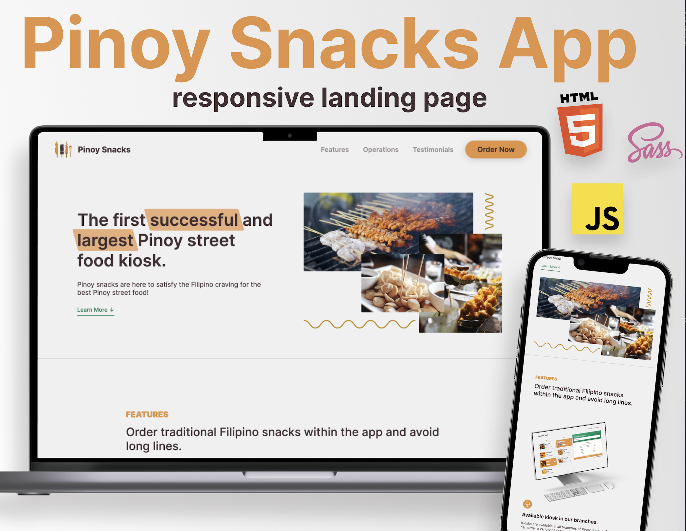

# ⏲  Pinoy Snacks App: Landing Page

Landing page for Pinoy Snacks App. It's a kiosk-like ordering system where customers can tap their food choice and have receipt that updates in real-time. Website contains the app's features, how it operates, and customer testimonials.
## Tech Stack
`HTML 5`,  `SASS`, `JavaScript`

⚡️ Intersection Observer API was used to implement the `Sticky Navigation`, `Revealing Elements on Scroll`, and `Lazy Loading Images`.


## App Screens

 
## Run Locally

Install dependencies (this will install `sass` and `live-server`)

```bash
  npm install
```

Start the server

```bash
  npm run start
```
## License

> Read license [here](LICENSE.txt)
